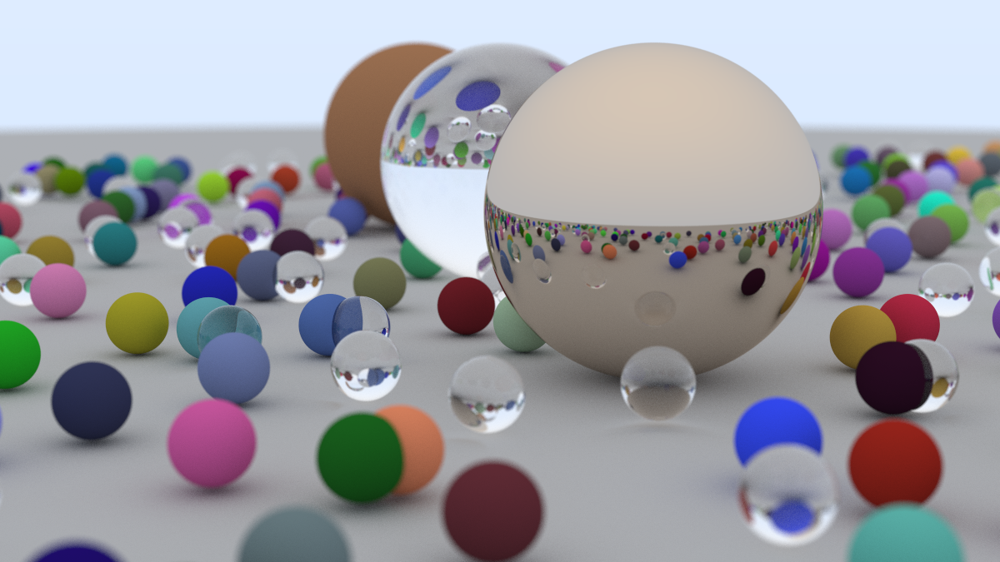

# Renderer

C++ implementation of rendering algorithms. 

## Supported Rendering Algorithm

* Ray tracing 

## Dependencies 

* Eigen3
* g++ 
* cmake
* Tested under Ubuntu 20.04 

## Build & Run

```bash
mkdir build
cd build
cmake ..
make 
./rtweekend > rtweekend 
```

By default, the program uses the CPU to start 8 threads for rendering. Rendering takes about 20 minutes on a laptop equipped with Intel® Core™ i7-10750H CPU @ 2.60GHz × 12 and 15.4GB of RAM. After rendering, you will get the following image:



## References

* [Ray Tracing in One Weekend](ttps://raytracing.github.io/books/RayTracingInOneWeekend.html#wherenext?/nextsteps/otherdirections)