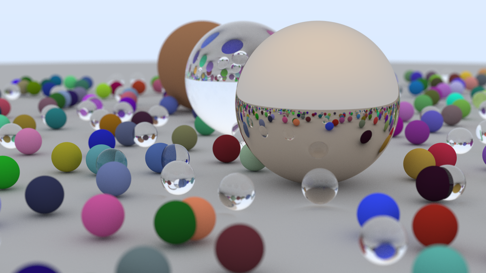
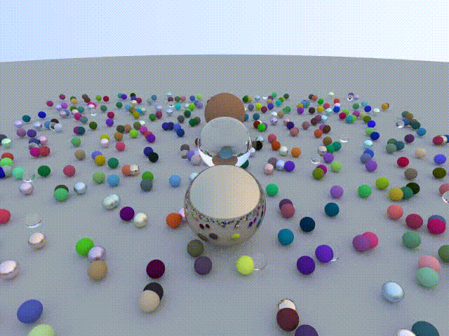
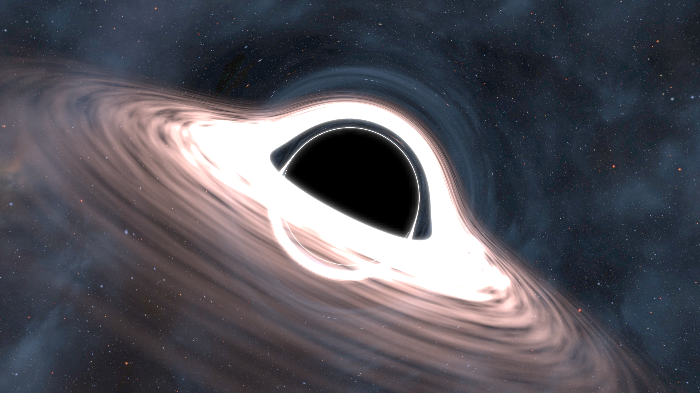
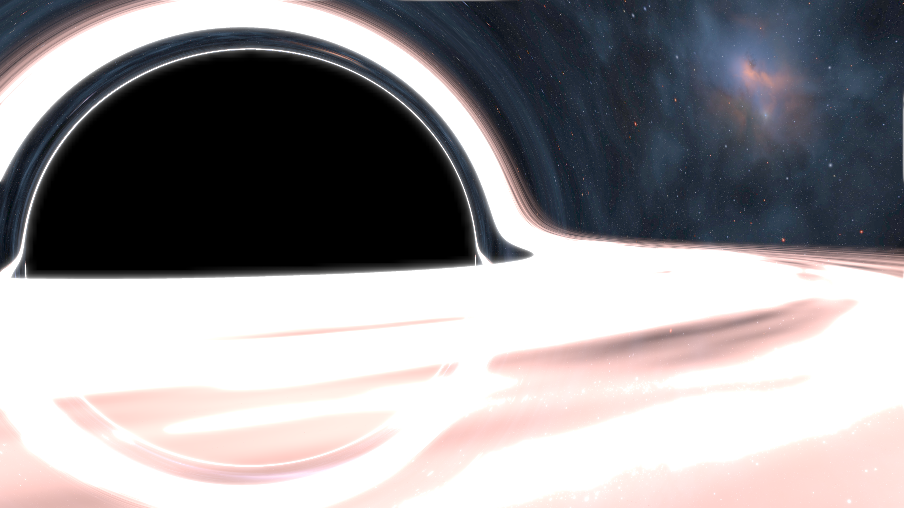
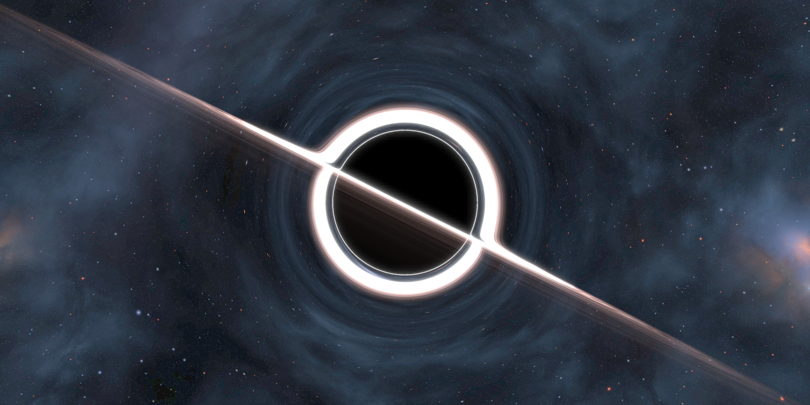

# Renderer

C++ implementation of rendering pipelines. 

## Supported Rendering Pipeline

* Ray tracing (In Euclidean space)
* Black hole ray marching rendering under Schwarszchile metric

## Dependencies 

* Eigen3
* OpenCV 4
* g++ 
* CUDA 11.3
* cmake
* Tested under Ubuntu 20.04 

## Build & Run

### CPU Rendering

```bash
mkdir build
cd build
cmake ..
make 
./rtweekend > rtweekend.ppm
```

By default, the program uses the CPU to start 8 threads for rendering. Rendering takes about 20 minutes on a laptop equipped with Intel® Core™ i7-10750H CPU @ 2.60GHz × 12 and 15.4GB of RAM. After rendering, you will get the following image:



### GPU Rendering

#### RTWeekend

* Rendering a single image

```bash
./rtweekend_cuda
```

* Rendering a video

```bash
./video_generator /path/to/output/video
```

​	The output video will be like



#### Black Hole Rendering

```bash
# Rendering a single image
./blackhole_rendering /path/to/accretion_disk_texture /path/to/background_texture /path/to/output/image
# Rendering a video
./blackhole_rendering /path/to/accretion_disk_texture /path/to/background_texture /path/to/output/video -v
# Interactive real-time rendering of a simplified scene (Only support a single black hole located at the origin of the global frame)
# Use the left button or middle button of the mouse to rotate or move the camera
./realtime_blackhole_rendering /path/to/accretion_disk_texture /path/to/background_texture
```

The outputs will be like: 







<video>
    <source src="./black_hole_2k_1.mp4" type="video/mp4">
</video>

## References

* [Ray Tracing in One Weekend](ttps://raytracing.github.io/books/RayTracingInOneWeekend.html#wherenext?/nextsteps/otherdirections)